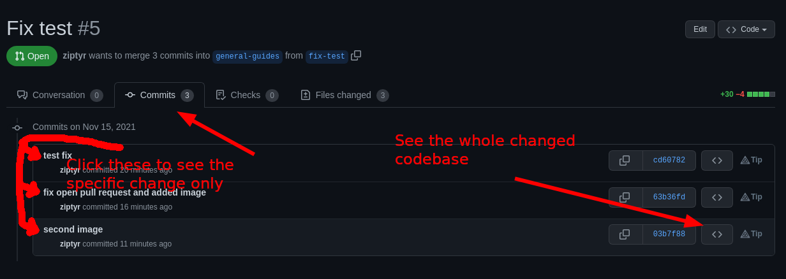

# GIT

## Git Pull Request

### Make Pull Request

If you want to make a pull request.

##### Go into the branch you want to change

`git checkout branch-you-want-to-change`

##### Make a new branch

`git checkout -b new-branch-name`

Do your changes in this branch.

##### Commit your changes

This adds all changes files into commit.

`git add -A`

This will make a commit of the changes.

`git commit -m "message what the commit does"`

> You can use `git status` and `git diff` or `git diff path/to/file` if you don't remember what you
have changed.

> Files can be added and committed one by one:
>
> `git add path/to/file`
> `git commit -m "what does this commit do"`
>
> `git add first/file/to/commit`
> `git add second/file/to/commit`
> `git commit -m "what does this change"`

##### Push the new branch to upstream

> `git status` is a good idea to check before pushing. If upstream happens to be ahead of your
branch it will lead into git merges.

`git push --set-upstream origin new-branch-name`

##### Make pull request

1. Open your branch in Github
2. Click **Contribute**
3. Click **Open Pull Request**

**CHECK THAT YOU ARE MERGING INTO CORRECT BRANCH BEFORE YOU CREATE THE REQUEST**

1. Assign Pull Request to the branch owner or to whom ever you choose.
2. Add comments from below if you want.

### Handle Pull Request

If you receive a pull request.

##### Read the comments and the commits

Commits can be opened in the web page or with git commands.

`git checkout new-branch-name`

You might like to see the old and new code side by side.

##### Make your own changes

If the Pull Request requires some changes before it can be accepted you can write them in this same
branch.

##### Commit and push your own changes

`git add -A`

`git commit -m "needed some changes"`

`git push`

##### Merge pull request

If everything is now in order go ahead and click `Merge pull request`. And the the next confirmation.

**Before you close the page** you can delete the merged `new-branch-name` now with the `Delete` button that opened up to the right side where the `Merge pull request` used to be at.
