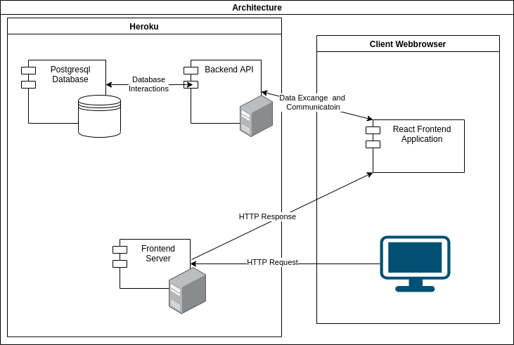

# awa-documentation

## [API](https://awa-food-app.stoplight.io/docs/awa-food-app-api/YXBpOjI4OTEwMDQ1-awa-food-api)

Stoplight API documentation following the openAPI standard

## [Design](Design.md)

General project design

## [Database](Database.md)

Database tables and SQL statements/queries

## [Testing](Testing.md)

This document describes what kind of tests where done 
and how the testing process was documented. The test
cases and test results can be found [here](https://github.com/AWAProjectT35/awa-documentation/tree/main/Testing)

## Application Architecture

